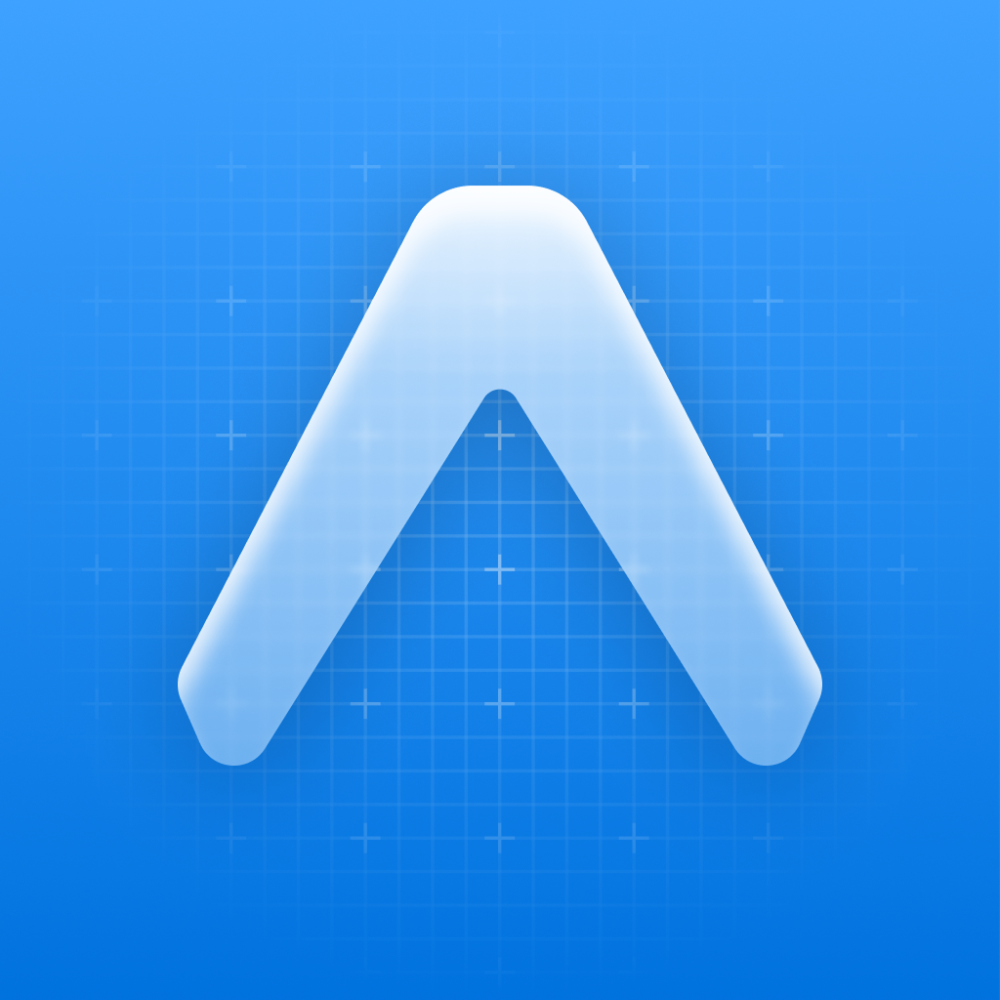

<div align="center">
  
  <h1>Noyara</h1>
  <p>A cross-platform application built with Expo and React Native.</p>

<p align="center">
  <a href="https://github.com/NoyaraAI/Noyara">
    
  </a>
  <a href="https://discord.gg/q9QK3F7wW">
    
  </a>
  <a href="https://github.com/NoyaraAI/Noyara/blob/development/LICENSE">
    
  </a>
  <a href="https://github.com/AppajiDheeraj">
    
  </a>
</p>

</div>

## Getting started

Requires Node.js 22.13 or later.

```bash
git clone https://github.com/NoyaraAI/Noyara.git
cd Noyara
npm ci
npm start
```

Run a specific platform:

```bash
npm run android
npm run ios
npm run web
```

## Contributing

See [CONTRIBUTING.md](CONTRIBUTING.md) for contribution guidelines. Report security vulnerabilities privately as described in [SECURITY.md](SECURITY.md).

Agent-assisted contributions follow [AGENTS.md](AGENTS.md). The repository includes project-local skills for truthful prose, recurring-friction capture, merge-ready review, and official Expo framework guidance.

## Community

Join the [Noyara Discord](https://discord.gg/q9QK3F7wW).

## Built by

[Appaji Dheeraj](https://github.com/AppajiDheeraj) · [LinkedIn](https://www.linkedin.com/in/appaji-dheeraj/) · [X](https://x.com/AppajiDheeraj)

## License

Licensed under the [MIT License](LICENSE).
